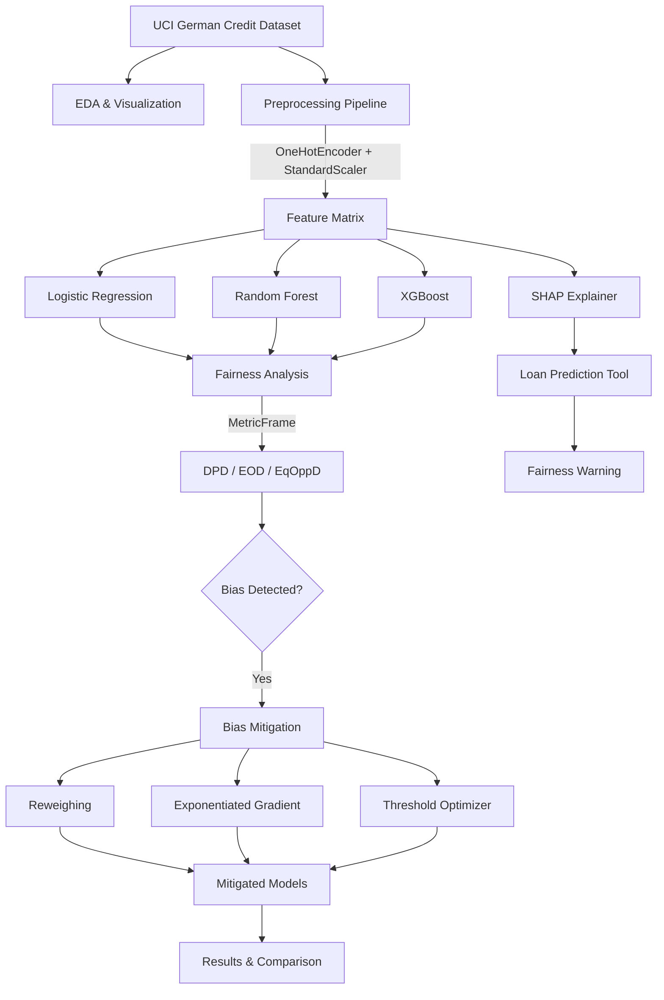

# FairLoan AI — Fairness & Bias Mitigation in Loan Approval using ML

A comprehensive final-year project demonstrating fairness-aware machine learning for loan approval decisions using the UCI German Credit Dataset.

## Project Overview

This Streamlit web application explores:
- **Algorithmic bias** in credit scoring ML models
- **Fairness measurement** using industry-standard metrics (DPD, EOD, Equal Opportunity)
- **Bias mitigation** using pre/in/post-processing techniques
- **Explainability** using SHAP values for individual decisions
- **Regulatory compliance** with EU AI Act (2024) and RBI Guidelines (2022)

## Setup Instructions

### Prerequisites
- Python 3.9+ 
- pip package manager

### Installation

```bash
# Clone the repository
git clone <your-repo-url>
cd fairloan-ai

# Install dependencies
pip install streamlit pandas scikit-learn xgboost fairlearn plotly numpy joblib shap scipy matplotlib seaborn requests

# Run the application
streamlit run app.py
```

The app will open at `http://localhost:8501`

## Project Structure

```
fairloan-ai/
├── app.py                      # Main Streamlit entry point
├── utils.py                    # Core ML and fairness utilities
├── pages/
│   ├── 1_Home.py               # Project overview & regulatory context
│   ├── 2_EDA.py                # Exploratory Data Analysis
│   ├── 3_Model_Training.py     # Baseline model training
│   ├── 4_Fairness_Analysis.py  # Fairness metrics computation
│   ├── 5_Bias_Mitigation.py    # Mitigation techniques comparison
│   ├── 6_Loan_Prediction.py    # Interactive prediction tool
│   └── 7_Results_Report.py     # Dashboard & exports
├── data/
│   └── german_credit.csv       # Auto-downloaded UCI dataset
├── models/
│   ├── logistic_regression.pkl
│   ├── random_forest.pkl
│   ├── xgboost.pkl
│   └── preprocessor.pkl
├── .streamlit/
│   └── config.toml             # Streamlit configuration
└── README.md
```

## Architecture Diagram



## Technology Stack

| Component | Technology |
|-----------|------------|
| Frontend | Streamlit |
| ML Framework | scikit-learn, XGBoost |
| Fairness | fairlearn |
| Explainability | SHAP |
| Visualization | Plotly |
| Data Processing | pandas, numpy |
| Model Persistence | joblib |
| Statistics | scipy |

## Pages Description

### 1. Home
Project overview, abstract, objectives, regulatory context (EU AI Act, RBI Guidelines), and team information.

### 2. EDA (Exploratory Data Analysis)
- Auto-downloads UCI German Credit Dataset
- Shows distributions, correlation heatmap
- Bias preview by protected attributes

### 3. Model Training
- Trains Logistic Regression, Random Forest, XGBoost
- Shows accuracy, precision, recall, confusion matrices, ROC curves
- Feature importance visualization

### 4. Fairness Analysis
- Demographic Parity Difference (DPD)
- Equalized Odds Difference (EOD)  
- Equal Opportunity Difference
- Group-level metrics using fairlearn MetricFrame

### 5. Bias Mitigation
- Pre-processing: Reweighing
- In-processing: Exponentiated Gradient Reduction
- Post-processing: Threshold Optimizer
- Side-by-side fairness vs accuracy comparison

### 6. Loan Prediction Tool
- Form with all 20+ features
- Prediction with confidence score
- Feature importance explanation
- SHAP values (if SHAP installed)
- Fairness warning for protected groups

### 7. Results & Report
- Master comparison dashboard
- Export CSV/JSON fairness reports
- Report template for documentation

## Dataset Information

**UCI German Credit Dataset**
- URL: https://archive.ics.uci.edu/ml/machine-learning-databases/statlog/german/german.data
- Samples: 1,000 loan applications
- Features: 20 (13 categorical + 7 numerical)
- Target: 1=Good Credit (Approved), 2=Bad Credit (Denied)
- Protected attributes: Sex (derived from personal_status), Age

## Fairness Metrics Reference

| Metric | Formula | Threshold |
|--------|---------|-----------|
| Demographic Parity Difference | \|P(ŷ=1\|A=0) − P(ŷ=1\|A=1)\| | < 0.10 |
| Equalized Odds Difference | max(\|ΔTPR\|, \|ΔFPR\|) | < 0.10 |
| Equal Opportunity Difference | \|TPR_a − TPR_b\| | < 0.10 |

## Regulatory Context

### EU AI Act (2024)
- Credit scoring classified as **High-Risk AI** (Annex III)
- Mandatory: bias testing, transparency, human oversight
- Article 13: Right to explanation for automated decisions

### RBI Guidelines (2022)
- Non-discriminatory algorithmic lending
- Explainable credit decisions
- Board-approved AI/ML policies

## Future Scope

1. Intersectional fairness (sex × age simultaneously)
2. Causal fairness / counterfactual analysis
3. Continuous fairness monitoring (drift detection)
4. Larger datasets (HMDA, Credit Bureau)
5. Model cards and datasheets integration

## References

1. Hardt et al. (2016). Equality of Opportunity in Supervised Learning. NeurIPS.
2. Kamiran & Calders (2012). Data Preprocessing for Classification without Discrimination. KAIS.
3. Agarwal et al. (2018). A Reductions Approach to Fair Classification. ICML.
4. Lundberg & Lee (2017). A Unified Approach to Interpreting Model Predictions. NeurIPS.

## Screenshots Section

*(Add screenshots of each page after running the application)*

- [ ] Home page with project overview
- [ ] EDA — bias preview charts
- [ ] Model Training — ROC curves
- [ ] Fairness Analysis — metrics comparison
- [ ] Bias Mitigation — before/after comparison
- [ ] Loan Prediction — decision with explanation
- [ ] Results — master comparison dashboard

---

*Final Year Project | Department of Computer Science / AI | Academic Year 2024–25*
